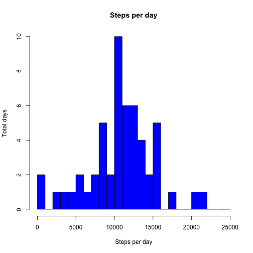
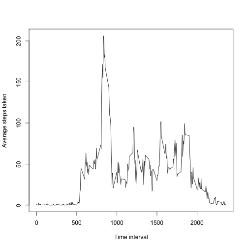
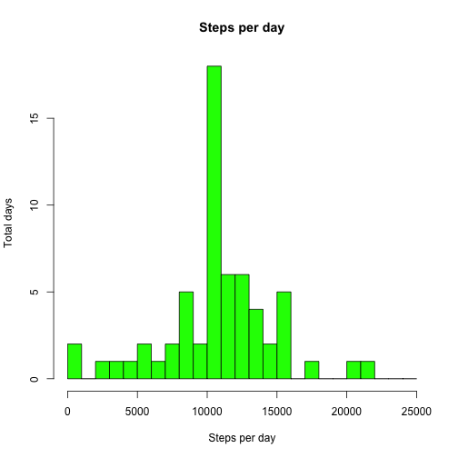
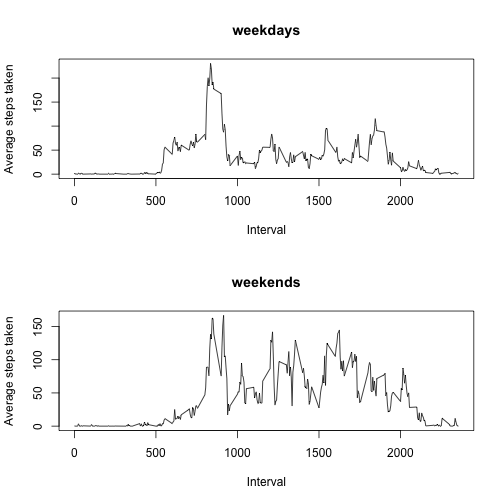

Peer Assessment 1
=======================
by Luis Martin Alonso


First, we set the working directory.

```r
setwd("/Users/luismartinalonsosanchez/Downloads/Coursera/Data Science Specialization/5. Reproducible Research")
```

Then, we read the data in the activity.csv file.

```r
data<-read.csv("activity.csv")
```

For our work, we will convert the data into a data table

```r
library(data.table)
data<-data.table(data)
```

## What is the mean total number of steps taken per day?

First, we will get an histogram of the total number of steps taken per day

```r
datah<-tapply(data$steps,data$date,sum)
datah<-data.table(datah)
datah<-datah[,date:=levels(data$date)]
datah<-na.omit(datah)
hist(datah[[1]],breaks=seq(from=0,to=25000,1000),xlab="Steps per day",ylab="Total days",main="Steps per day",col="blue")
```

 

Then, we calculate the mean and median of steps taken each day

```r
meansteps<-mean(datah[[1]])
meansteps
```

```
## [1] 10766.19
```

```r
mediansteps<-median(datah[[1]])
mediansteps
```

```
## [1] 10765
```

## What is the avergae daily activity pattern?

Now, we want to know the steps taken in the different time intervals.

```r
datap<-transform(data,interval=factor(interval))
datap<-na.omit(datap)
ypl<-tapply(datap$steps,datap$interval,mean)
ypl<-as.vector(ypl)
plot(levels(datap$interval),ypl,type="l",xlab="Time interval",ylab="Average steps taken")
```

 

We also want to know in which time interval more steps are taken

```r
for(i in 1:288){
     if(ypl[i]==max(ypl)){ print(levels(datap$interval)[i])}
}
```

```
## [1] "835"
```

## Imputing missing values

First, we will get the quantity of missing values from the data set

```r
datamiss<-data$steps
datamiss<-is.na(datamiss)
datamiss<-as.numeric(datamiss)
datamiss<-sum(datamiss)
datamiss
```

```
## [1] 2304
```

Now that we know the quantity of missing value, we will replace them with the average of the  
steps in the corresponding time interval

```r
datam<-transform(data,interval=factor(interval))
datam<-transform(datam,date=factor(date))
averagetimeinterval<-rep(ypl,times=61)
datam<-datam[,AvInt:=averagetimeinterval]
datam<-datam[,IsNa:=as.numeric(is.na(steps))]
datam<-datam[,IsNotNa:=as.numeric(!is.na(steps))]
datam<-datam[,Newsteps:=IsNa]
for(i in 1:17568){
    if(is.na(datam$steps[i])){datam$Newsteps[i]=0}
    else {datam$Newsteps[i]=datam$steps[i]}
}
datam<-datam[,Neweststeps:=Newsteps+AvInt*IsNa]
```

Now, we will make a histogram with the new data

```r
datamh<-tapply(datam$Neweststeps,datam$date,sum)
datamh<-data.table(datamh)
datamh<-datamh[,date:=levels(datam$date)]
hist(datamh[[1]],breaks=seq(from=0,to=25000,1000),xlab="Steps per day",ylab="Total days",main="Steps per day",col="green")
```

 

If we compare this histogram with the first one, we can note that there is one difference. The value collecting the steps taken between 10000 and 11000 has incremented a lot, while the rest has remained the same.

## Are there differences in activity patterns between weekdays and weekends??


```r
dataw<-data.table(datam)
dataw<-transform(dataw,interval=factor(interval))
dataw<-dataw[,NewDate:={NewDate<-date;as.Date(date,"%Y-%m-%d")}]
dataw<-dataw[,Weekday:=weekdays(NewDate,abbreviate=TRUE)]
dataw<-dataw[,weekday:=IsNa+IsNotNa]
for(i in 1:17568){
    if(!(dataw$Weekday[i]=="Sat" || dataw$Weekday[i]=="Sun")){dataw$weekday[i]="weekday"}
    if(dataw$Weekday[i]=="Sat" || dataw$Weekday[i]=="Sun") {dataw$weekday[i]="weekend"}
}
dataw<-transform(dataw,weekday=factor(weekday))
drv<-factor(dataw$weekday)
dataw1<-dataw[weekday=="weekday",]
dataw2<-dataw[weekday=="weekend",]
yypl<-tapply(dataw1$Neweststeps,dataw1$interval,mean)
yypl<-as.vector(yypl)
yypl2<-tapply(dataw2$Neweststeps,dataw2$interval,mean)
yypl2<-as.vector(yypl2)
par(mfrow=c(2,1))
plot(levels(dataw1$interval),yypl,type="l",xlab="Interval",ylab="Average steps taken",main="weekdays")
plot(levels(dataw2$interval),yypl2,type="l",xlab="Interval",ylab="Average steps taken",main="weekends")
```

 
After analysing the patterns, we can see that people start earlier in weekdays, but  
they walk more in the weekends.
